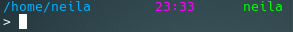

# Promptach

[English](../README.md) | 中文普通话大陆简体

一个插件化的、高度可配置的prompt生成器。

## 效果



## 功能

### 焕然一新的路径显示

#### Git文件夹

在Promptach中，git分支不再像其他prompt生成器那样显示在路径外，而是包含在路径中。  
考虑一下这个场景：您位于位于`~/projects/example`的git存储库`main`分支上的`docs`文件夹中。在其他prompt生成器中，它通常看起来像这样：

```bash
~/project/example/docs (on main)
```

而在Promptach中，它将以更符合人体工程学的方式显示：

```bash
~/project/example main docs
```

#### 路径替换

Promptach还提供路径替换显示的设置。在上述场景中，如果`projects`被配置为显示为`📁`, 它将显示如下：

```bash
~/📁/example main docs
```

#### 带符号链接的路径

当输入带有符号链接的路径时，将显示符号链接。  
考虑以下情况：

```bash
> tree /foo
foo
└── content
> tree /bar
├── abs -> /foo
└── rel -> ../foo
```

输入`/bar/abs/content`时，路径将显示为`/bar/(abs → /foo)/content`；  
输入`/bar/rel/content`时，路径将显示为`/bar/(rel → ../foo)/content`。

### 图形化的设置界面

没有无数的YAML、TOML或INI文件需要编辑——Promptach提供了一个清晰直观的图形设置界面。  
当然，如果你愿意，你仍然可以直接编辑。

#### 设置程序

运行`PromptachSettings`。

#### 配置文件位置

在`$XDG_CONFIG_DIRS/Promptach`中。

### 简洁的显示

没有圆角，没有背景色，只有纯文本和精心混合的前景色。  
始终可用的右提示符——在Promptach中，右提示符是通过检测控制台宽度来实现的，不依赖于特定的shell。  
如果你想要，文本数不仅仅局限于左、右：中提示符或更多也被支持。

### 快速

Promptach不是用shell编写的。它是用C++编写的。

## 构建

```bash
nix build
```

## 从cachix安装

https://promptach.cachix.org/#pull

## 用法

在shell中，将环境变量`PROMPT_COMMAND`（不是`PS1`）设置为`Promptach`。  
此外，它不会覆盖需要手动设置的`PS1`。建议将PS1设置为`> `。

## 已知问题

- 与[ble.sh](https://github.com/akinomyoga/ble.sh)不兼容。  
  不会报错，但存在明显的视觉问题，例如预期之外的额外换行。
- 设置程序中ANSI颜色被直接显示。
- 设置程序中经常出现更改没有及时显示，需要重启。
